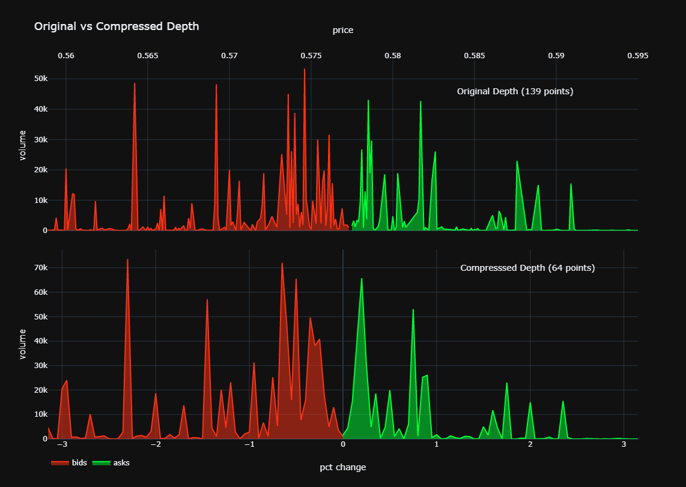

## Data Visualization Using Plotly

Trying to include graphs in the README file and experimenting with GitHub hosting to display Plotly graph HTML pages.

### link form Plotly dashboard

    

### img

)
